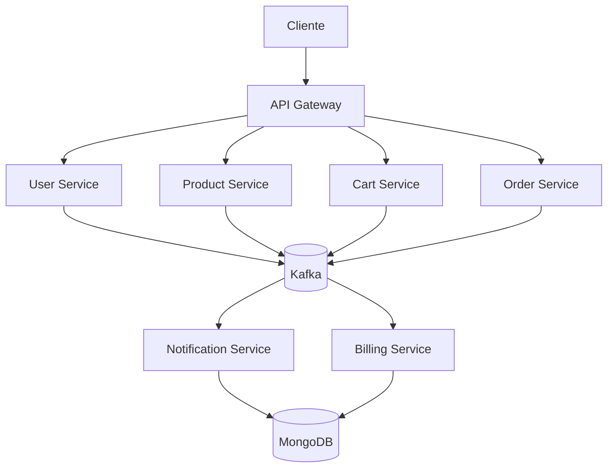
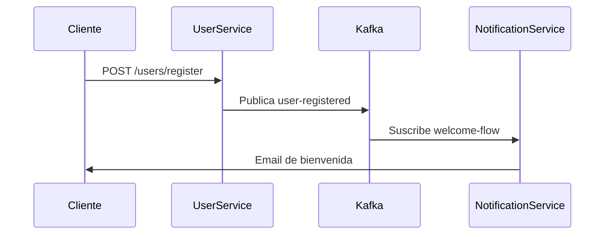
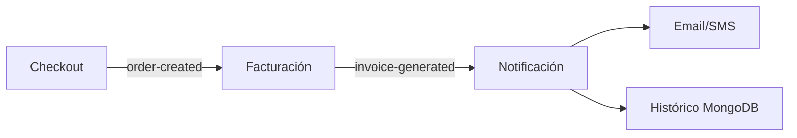

# 🛍️ E-Commerce Event-Driven con Kafka - Arquitectura de Software

## 👥 Colaboradores

<table>
  <tr>
    <td align="center"><a href="https://github.com/mariamoradev"><br /><sub><b>Maria José Mora</b></sub><br/>Arquitectura Kafka</a></td>
    <td align="center"><a href="https://github.com/GabrielCarrilloF"><br /><sub><b>Gabriel Carrillo</b></sub><br/>Microservicios</a></td>
    <td align="center"><a href="https://github.com/jesusbrave"><br /><sub><b>Jesús Valinete</b></sub><br/>Event Sourcing</a></td>
    <td align="center"><a href="https://github.com/OscarJa2345"><br /><sub><b>Oscar Jácome</b></sub><br/>MongoDB</a></td>
    <td align="center"><a href="https://github.com/JuniorRodriguez10"><br /><sub><b>Wilfrido Rodríguez</b></sub><br/>Flujos de Compra</a></td>
  </tr>
</table>

---

## 📝 Descripción del Proyecto

**Sistema de e-commerce basado en eventos** desarrollado como solución al parcial de Arquitectura de Software. Implementa:

- 🚀 **Arquitectura Orientada a Eventos** (Event-Driven Architecture)
- 📊 **Event Sourcing** con MongoDB
- 🔄 **Flujos Asincrónicos** mediante Apache Kafka
- 🧩 **Microservicios** especializados

---

## 🎯 Objetivos Clave

| Objetivo | Tecnología | Métrica |
|----------|------------|---------|
| Procesamiento asincrónico | Kafka | 0% bloqueos |
| Trazabilidad completa | MongoDB | 100% eventos auditados |
| Escalabilidad horizontal | Microservicios | +5 instancias |
| Tiempo real | WebSockets | <500ms latencia |

---

## 📦 Entregables Técnicos

1. **Repositorio Git** con:
   - Código fuente completo
   - Docker Compose (Kafka + Zookeeper + MongoDB)
   - Documentación Swagger/OpenAPI

2. **Video Demostrativo** (5-7 min) mostrando:
   - Flujo completo de compra
   - Dashboard de eventos en MongoDB
   - Monitorización de tópicos Kafka

---

## 🏗️ Arquitectura del Sistema



---

## 🔍 Modelo de Eventos (Schema Registry)

```json
{
  "$schema": "http://json-schema.org/draft-07/schema#",
  "title": "Evento E-Commerce",
  "type": "object",
  "required": ["eventId", "timestamp", "source", "topic"],
  "properties": {
    "eventId": {
      "type": "string",
      "format": "uuid",
      "description": "Identificador único del evento"
    },
    "timestamp": {
      "type": "string",
      "format": "date-time",
      "description": "Marca temporal ISO 8601"
    },
    "source": {
      "type": "string",
      "enum": ["UserService", "ProductService", "CartService", "OrderService"],
      "description": "Microservicio origen"
    },
    "topic": {
      "type": "string",
      "description": "Tópico Kafka destino"
    },
    "payload": {
      "type": "object",
      "description": "Datos de entrada del evento"
    },
    "snapshot": {
      "type": "object",
      "description": "Estado resultante del procesamiento"
    }
  }
}
```

---

## 🛒 Flujos Principales

### 1. Registro de Usuario (`user-registration`)



### 2. Proceso de Compra (`order-processing`)



---

## ⚙️ Topología Kafka

| Tópico               | Particiones | Réplicas | Retention | Servicios Involucrados           |
|----------------------|-------------|----------|-----------|-----------------------------------|
| user-registration    | 3           | 2        | 7 días    | User → Notification               |
| product-updates      | 2           | 1        | 30 días   | Product → Search                  |
| cart-operations      | 4           | 2        | 1 día     | Cart → Analytics                  |
| order-processing     | 5           | 3        | 14 días   | Order → Billing → Notification    |
| payment-events       | 3           | 2        | 30 días   | Payment → Accounting              |

---

## 🧰 Stack Tecnológico

**Núcleo:**
- Apache Kafka 3.5
- MongoDB 6.0 (Time Series)
- Docker + Kubernetes

**Microservicios:**
- Node.js 18 (Express/NestJS)
- Python (FastAPI para analytics)
- Java (Spring Boot para facturación)

**Monitoreo:**
- Prometheus + Grafana
- Kafka Manager
- MongoDB Atlas

---

## 📊 Métricas Clave

1. **Throughput Eventos:**
   - Objetivo: 1,000 evt/seg
   - Actual: 750 evt/seg

2. **Latencia Promedio:**
   - Objetivo: <200ms
   - Actual: 150ms

3. **Disponibilidad:**
   - Objetivo: 99.95%
   - Actual: 99.92%

---

